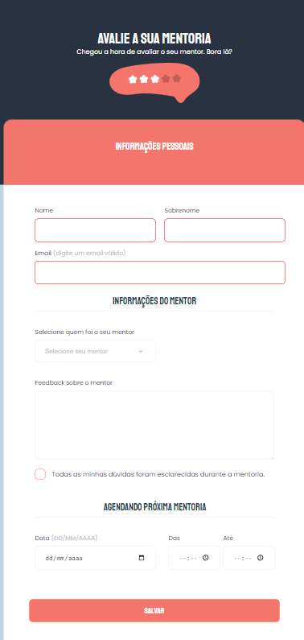

<h1 align="center">Avalie a sua mentoria</h1>

  

Criando formulários avançado, curso exclusivo, promovido pela Rocketseat para ensino de tecnologias WEB.

  <a href="#-tecnologias">Tecnologias</a>&nbsp;&nbsp;&nbsp;|&nbsp;&nbsp;&nbsp;
  <a href="https://rafael-malaquias.github.io/Stage-03-form/">Projeto</a>&nbsp;&nbsp;&nbsp;|&nbsp;&nbsp;&nbsp;
  <a href="https://www.figma.com/file/4lqgH7HrVCtByksPurfDEY/Stage-03---Formul%C3%A1rio-avan%C3%A7ado-(Copy)?node-id=0%3A1&mode=devt">Layout</a>&nbsp;&nbsp;&nbsp;|&nbsp;&nbsp;&nbsp;
  <a href="#memo-licença">Licença</a>

  

 

## 🚀 Tecnologias

Esse projeto foi desenvolvido com as seguintes tecnologias:

- HTML e CSS
- Git e Github
- Figma

## 💻 Projeto

Avaliação de Mentoria, Este formulário foi criado com HTML e CSS, oferece uma experiência de usuário intuitiva e agradável, garantindo que sua avaliação seja fácil de ser expressa.

[Link](https://rafael-malaquias.github.io/Stage-03-form/) - Para visualizar o projeto.

## 🔖 Layout

Você pode visualizar o layout do projeto através [DESSE LINK](https://www.figma.com/file/4lqgH7HrVCtByksPurfDEY/Stage-03---Formul%C3%A1rio-avan%C3%A7ado-(Copy)?mode=dev). É necessário ter conta no [Figma](https://figma.com) para acessá-lo.

##  📝 Licença

Esse projeto está sob a licença MIT.

---